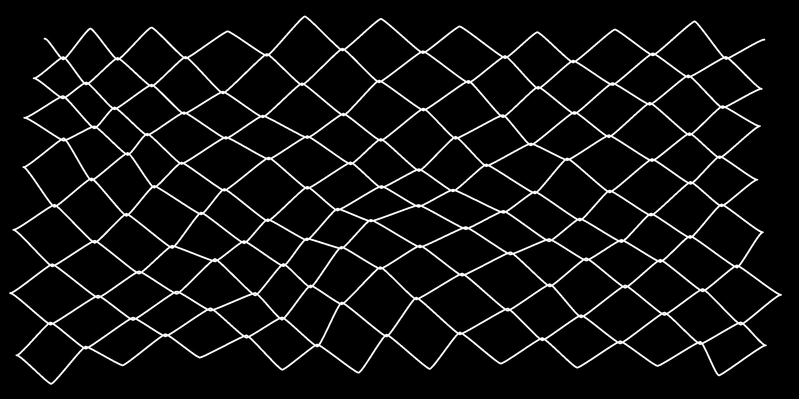

# Generative Mesh



A generative chain-link fence, wire netting, wire-mesh fence, chain-wire fence, cyclone fence, hurricane fence, diamond-mesh fence...

## Usage

### Prerequisites

- [Node.js](https://nodejs.org) or [Docker](https://www.docker.com)

### Run

**With Node**

```
npm install
npm run dev
```

**With Docker**

```
docker-compose up
```

Then open `http://localhost:5173/wire-mesh`.
